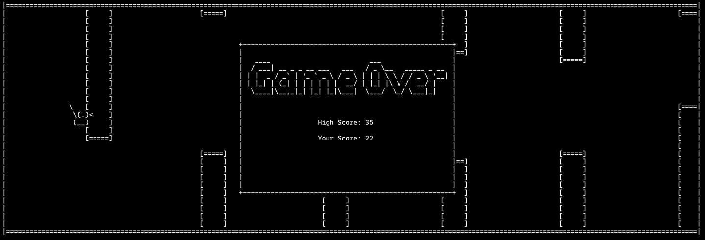

# Java Flappy Bird

This is a simple Flappy Bird game written in **Pure Java** for the computer science class final project.

The rendering works through a custom `Renderer` class that merges overlays to print the game on the screen using only `System.out.print()`.

The game is controlled using the `Enter` key to jump, play, and play again. The enter key is used as an input through the use of a secondary thread that uses `scanner.nextLine()` to wait for the user to press enter.

